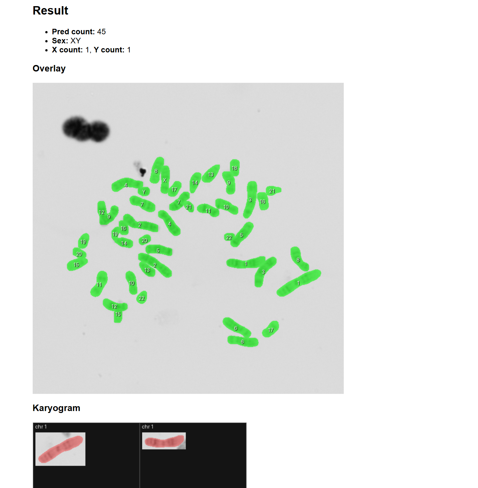

# Karyo Test

Automatically segment and identify human chromosomes.

- **Input**: grayscale metaphase images.
- **Output (per image)**: ~46 chromosome instances (23 pairs) labeled with IDs `{1..22, X, Y}`.

### Model Output
- **boxes**: `Float32[M, 4]`
- **labels**: `Int64[M]` (1..24)
- **scores**: `Float32[M]`
- **masks**: `Float32[M, 1, H, W]`

Chromosomes should be paired into 23 groups.

## Datasets
This project uses multiple datasets such as "Cell Image Library", "AutoKary2022", and others for training, testing, and validation. Detailed descriptions can be found in [task.md](task.md).

## Test images
Sample images for quick testing are in `test_images/`.

## Running the Application with Docker

### Steps:
1. Build the Docker image:
   ```bash
   docker-compose build
   ```

2. Run the image 
   ```bash
    docker-compose up -d
   ```


